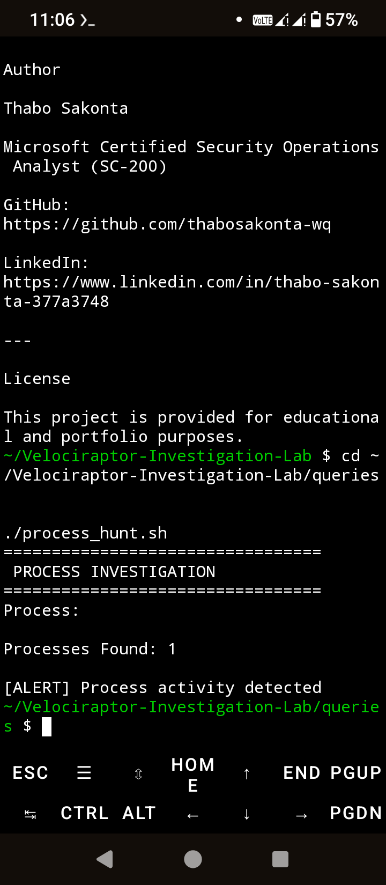
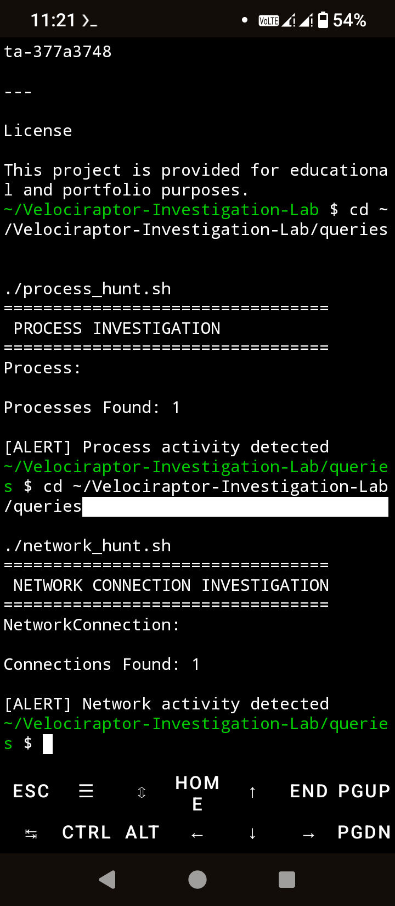
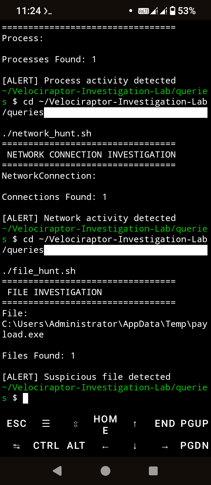

Velociraptor Investigation Lab

A Digital Forensics and Incident Response (DFIR) project demonstrating endpoint investigations using Velociraptor-style artifacts, threat hunting techniques, incident reporting, and MITRE ATT&CK mapping.

---

Overview

This lab simulates a Digital Forensics and Incident Response (DFIR) investigation where endpoint artifacts are collected and analyzed to identify suspicious activity on compromised systems.

The investigation focuses on:

- Process Investigation
- Network Connection Analysis
- Suspicious File Discovery
- Endpoint Artifact Analysis
- Incident Reporting
- MITRE ATT&CK Mapping

---

## Objectives

- Demonstrate endpoint investigation using Velociraptor concepts.
- Perform process, network, and file hunting.
- Analyze endpoint artifacts.
- Map findings to MITRE ATT&CK.
- Produce professional DFIR investigation reports.
- Demonstrate practical incident response skills.

---

Features

Process Investigation

Detects suspicious PowerShell execution and malicious processes.

Network Investigation

Identifies outbound network communications and suspicious external connections.

File Investigation

Discovers suspicious payloads and potentially malicious files.

Endpoint Artifact Analysis

Reviews endpoint artifacts collected during forensic investigations.

Investigation Reporting

Documents findings, severity assessment, and recommended response actions.

---

## Screenshots

### Process Investigation

### Network Investigation

### File Investigation

---

MITRE ATT&CK Coverage

Technique| ATT&CK ID| Description
PowerShell| T1059.001| Execution
Application Layer Protocol| T1071| Command and Control
Ingress Tool Transfer| T1105| Command and Control

---

Investigation Workflow

Endpoint Artifact Collection

↓

Process Investigation

↓

Network Investigation

↓

File Investigation

↓

Threat Analysis

↓

Incident Report

↓

MITRE ATT&CK Mapping

---

Technologies Used

- Velociraptor Concepts
- Digital Forensics
- Endpoint Investigation
- Incident Response
- Threat Hunting
- Linux
- Termux
- Git
- GitHub
- MITRE ATT&CK

---

Project Structure

Velociraptor-Investigation-Lab
├── artifacts
│   └── endpoint_artifacts.txt
├── queries
│   ├── account_hunt.sh
│   ├── file_hunt.sh
│   ├── network_hunt.sh
│   └── process_hunt.sh
├── reports
│   ├── mitre_mapping.md
├── screenshots
│   ├── file_hunt.png
│   ├── network_hunt.png
│   └── process_hunt.png
└── README.md

---

Learning Outcomes

- Digital Forensics
- Endpoint Investigation
- Threat Hunting
- Incident Response
- DFIR Methodology
- MITRE ATT&CK Mapping
- Security Monitoring

---

Author

Thabo Sakonta

Microsoft Certified Security Operations Analyst (SC-200)

GitHub:

https://github.com/thabosakonta-wq

LinkedIn:

https://www.linkedin.com/in/thabo-sakonta-377a3748

---

License

This project is intended for educational, research, and cybersecurity portfolio purposes.
